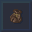

# Neutrino

A Light, Quality of Life Quark Spin-Off Fabric Mod for Minecraft

---

## Installation

### Manual installation (recommended)

You will need Fabric Loader 0.10.x or newer installed in your game in order to load Neutrino. If you haven't installed
Fabric mods before, you can find a variety of community guides for doing so [here](https://fabricmc.net/wiki/install).

### Reporting Issues

You can report bugs and crashes by opening an issue on our [issue tracker](https://github.com/frostwizard4/neutrino/issues).

### Building with Gradle

Sodium uses a typical Gradle project structure and can be built by simply running the default `build` task. After Gradle
finishes building the project, you can find the built mod in `build/libs`. Feel free to open a pull request!
